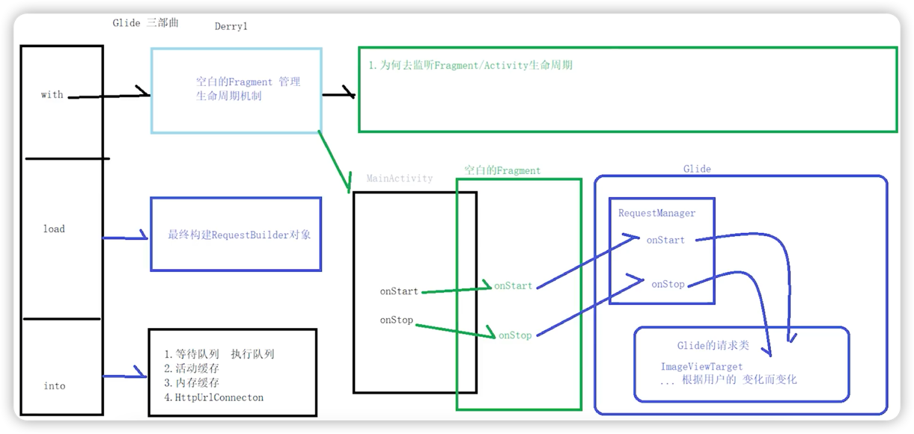
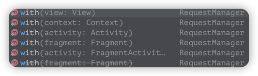
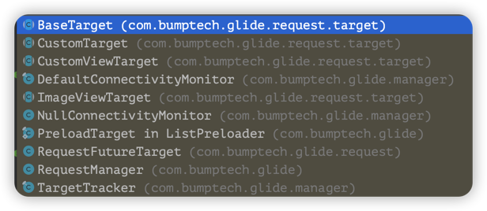

# Glide生命周期绑定

## 生命周期绑定

### 思考🤔
在Glide.with中，传入的是一个Activity，Glide会持有了Activity的引用，

那么当Activity销毁后，Glide的线程池如果仍在运行，会造成内存泄漏吗？

> 不会造成内存泄漏。
> 
> >Glide会创建一个空白的fragment依附在Activity上，来监听它的生命周期。
> >当activity销毁时会自动处理资源回收问题。



<br>

## 生命周期作用域

### 思考🤔
Glide.with()为什么会有那么多重载方法？



> 传入不同的参数，Glide的生命周期作用域会不一样。
> 
> 如果是在子线程中创建，无论什么参数，作用域都同于Application。
> 
> 如果在主线程中创建：
> 
> 1. View: Activity/Fragment
> 2. Fragment：Fragment
> 3. Activity：Activity
> 4. Service的Context/Application：Application

### 生命周期作用域

#### 在子线程中调用Glide
子线程中不能创建fragment，无法做生命周期管理。

如果引用Activity可能会造成内存泄漏，所以只能使用全局Context。

``` java
class ApplicationLifecycle implements Lifecycle {
  @Override
  public void addListener(@NonNull LifecycleListener listener) {
    listener.onStart();
  }

  @Override
  public void removeListener(@NonNull LifecycleListener listener) {
    // Do nothing.
  }
}
```

## 源码分析

1. 创建空白的fragment并绑定Activity

    [空白Fragment的创建与绑定](doc/空白Fragment的创建和绑定.md)

2. 绑定后，当Fragment的onStart、onStop和onDestroy被Activity触发后，会怎么做？
   #### SupportRequestManagerFragment.java
    ``` java
      @Override
      public void onStart() {
        super.onStart();
        // lifecycle是ActivityFragmentLifecycle类
        lifecycle.onStart();
      }
    
      @Override
      public void onStop() {
        super.onStop();
        lifecycle.onStop();
      }
    
      @Override
      public void onDestroy() {
        super.onDestroy();
        lifecycle.onDestroy();
        unregisterFragmentWithRoot();
      }
    ```
   #### ActivityFragmentLifecycle.java
    ``` java
       void onStart() {
           isStarted = true;
           for (LifecycleListener lifecycleListener : Util.getSnapshot(lifecycleListeners)) {
               lifecycleListener.onStart();
           }
       }
       
       void onStop() {
           isStarted = false;
           for (LifecycleListener lifecycleListener : Util.getSnapshot(lifecycleListeners)) {
               lifecycleListener.onStop();
           }
       }
       
       void onDestroy() {
           isDestroyed = true;
           for (LifecycleListener lifecycleListener : Util.getSnapshot(lifecycleListeners)) {
               lifecycleListener.onDestroy();
           }
       }    
    ```
   
   这个LifecycleListener有很多的子类，点击它的方法，可以看到被很多类调用到：

   

   > 上图这些Glide类都直接或间接地实现了LifeCycle接口，以感知生命周期。

   1. 当Activity生命周期发生变化后，Activity通知SupportRequestManagerFragment。
   2. SupportRequestManagerFragment通知ActivityFragmentLifecycle。
   3. ActivityFragmentLifecycle遍历所有的LifecycleListener实现类，并触发对应方法。

### 通知流

Activity -> SupportRequestManagerFragment -> ActivityFragmentLifecycle -> LifecycleListener（各种实现类）

> 这四个类全都有onStart、onStop、onDestroy方法。