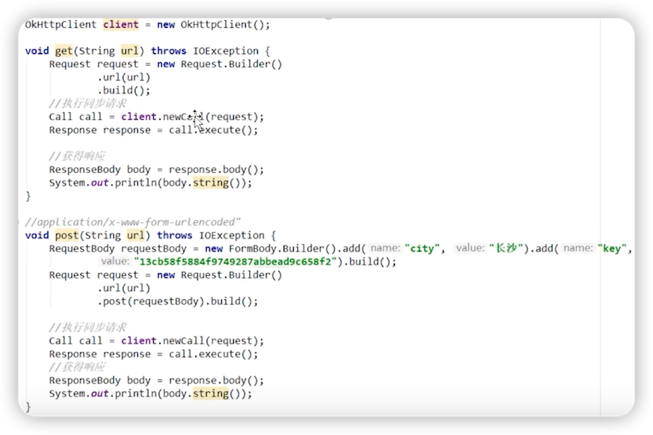
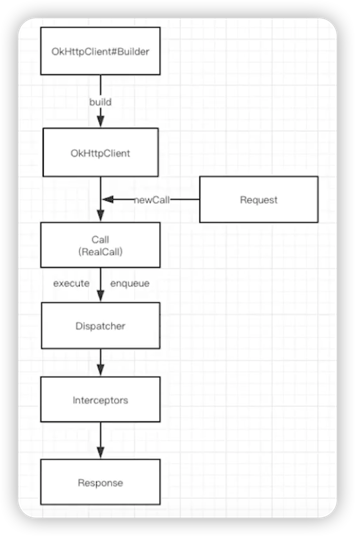

# OKHTTP使用流程

***
### GET 和 POST 代码样例

从上面代码可以看出：

请求过程中最少只需要接触 **OkHttpClient、Request、Call、Response**。

但是在Call执行Request获取Response的过程中，有两个非常重要的组件：**分发器**和**拦截器**。

>分发器：内部维护队列和线程池，完成**请求调配**。

>拦截器：完成整个**请求过程**。

***

**拦截器**的本质是完成**HTTP请求**流程，以及其他优化性的工作。

> ###回顾：HTTP请求过程
> 1. **DNS解析**，将域名解析为IP地址。
> 2. 根据IP地址**建立TCP连接**（🤝x3），获取到**Socket**对象（Socket本质是对TCP的封装）。
> 3. 利用Socket的输出流写**响应报文**，发送回客户端。
> 