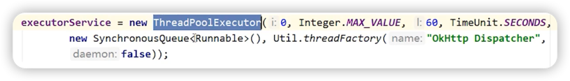

### 线程池的工作机制

***
### 为什么Dispatcher的请求队列要用ArrayDeque？

如果把ArrayDeque作为队列来使用，那么它要**比LinkedList更快**。

如果把ArrayDeque作为栈来使用，那么它要比Stack更快。
***
### Dispatcher的线程池是如何定义的？

1. 核心线程数：0
2. 最大线程数：无限制
3. 非核心线程的空闲存活时间，60秒
4. 任务队列用的是SynchronousQueue，所有任务无需等待，直接执行。
> SynchronousQueue没有容量，是无缓冲等待队列，是一个不存储元素的阻塞队列，会直接将任务交给消费者，必须等队列中的添加元素被消费后才能继续添加新的元素。
