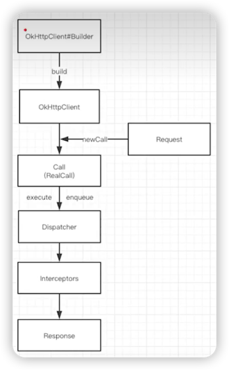

# OkHttp流程

## 1. 大致流程图

关键：在Call执行同步/异步请求，以获取响应过程中，**分发器**和**拦截器**的工作流程。

> 分发器：完成请求调配（内部维护队列和线程池）。
> 
> 拦截器：完成请求流程（责任链模式）。
> > 分发器是管理者，拦截器是劳动者。

***
【【底层原理学习】|OkHttp原理详解（全）】 https://www.bilibili.com/video/BV12Q4y1d7uD?p=7&share_source=copy_web&vd_source=9355e6cdd71213da3b305d759d88f1de