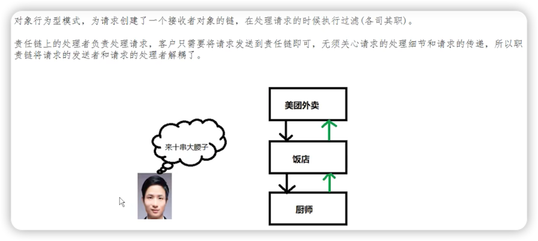
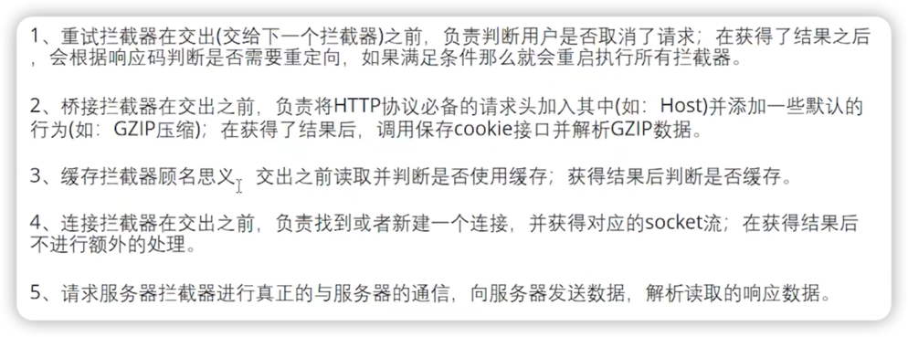
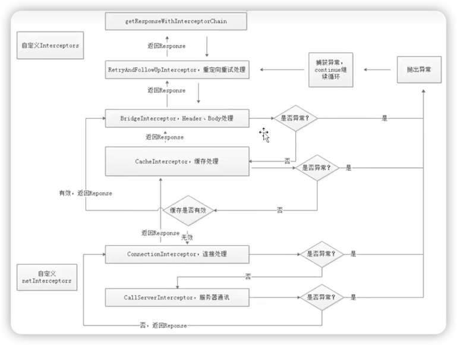

# 拦截器

## 复习
经过"分发器"篇章的学习，了解到：
1. AsyncCall是提交给线程池执行的Runnable任务。
2. 完成请求获取响应的流程，是在AsyncCall的execute方法中。
``` java
// AsyncCall.java
@Override 
protected void execute() {
    // ...
    try {
        // 通过拦截器完成请求，获得Response
        Response response = getResponseWithInterceptorChain();
        // 回调成功
        responseCallback.onResponse(RealCall.this, response);
    }
    // 如果发生异常在回调失败
    // ...
}
```
***
## getResponseWithInterceptorChain()

1. 方法名一定要牢记！（利用拦截器链获取响应）
2. 该方法用到了"责任链模式"（解耦请求的发起者和处理者，发起者只需得到结果，无需关心过程）
> 

``` java
Response getResponseWithInterceptorChain() throws IOException {
    // Build a full stack of interceptors.
    List<Interceptor> interceptors = new ArrayList<>();
    // 用户自定义的拦截器
    interceptors.addAll(client.interceptors());
    // 重试重定向拦截器
    interceptors.add(new RetryAndFollowUpInterceptor(client));
    // 桥接拦截器
    interceptors.add(new BridgeInterceptor(client.cookieJar()));
    // 缓存拦截器
    interceptors.add(new CacheInterceptor(client.internalCache()));
    // 连接拦截器
    interceptors.add(new ConnectInterceptor(client));
    if (!forWebSocket) {
      interceptors.addAll(client.networkInterceptors());
    }
    // 请求服务拦截器
    interceptors.add(new CallServerInterceptor(forWebSocket));

    Interceptor.Chain chain = new RealInterceptorChain(interceptors, transmitter, null, 0,
        originalRequest, this, client.connectTimeoutMillis(),
        client.readTimeoutMillis(), client.writeTimeoutMillis());

    boolean calledNoMoreExchanges = false;
    try {
      // 调用proceed方法会依次执行各个拦截器的intercept方法
      // 最终获得response
      Response response = chain.proceed(originalRequest);
      if (transmitter.isCanceled()) {
        closeQuietly(response);
        throw new IOException("Canceled");
      }
      return response;
    } catch (IOException e) {
      calledNoMoreExchanges = true;
      throw transmitter.noMoreExchanges(e);
    } finally {
      if (!calledNoMoreExchanges) {
        transmitter.noMoreExchanges(null);
      }
    }
}
```
### 各个拦截器的作用


### 拦截器链工作流程图



