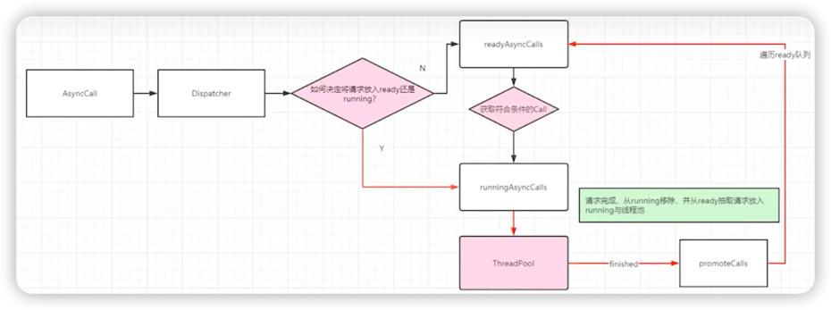

# Dispatcher的enqueue流程

1. 预备知识点
2. 流程分析
3. 等待队列中的任务何时尝试再次提交到执行队列中
4. 分发器的线程池

## 预备知识点

### 1. 分发器的线程池和双向队列

在分析流程之前，首先需要了解Dispatcher的线程池和队列

``` java
// 线程池
private @Nullable ExecutorService executorService;

// 等待执行的异步请求队列
private final Deque<AsyncCall> readyAsyncCalls = new ArrayDeque<>();

// 正在执行的异步请求队列
private final Deque<AsyncCall> runningAsyncCalls = new ArrayDeque<>();

// 正在执行的同步请求队列
private final Deque<RealCall> runningSyncCalls = new ArrayDeque<>();
```

### 2. 分发器的异步工作流程图



### 3. 思考
1. 分发器是如何决定将请求放入哪个队列的？
2. 等待队列中的请求，如何移动到执行队列中？
3. 线程池是如何定义的？

***

## 流程分析

``` java
// AsyncCall本质是一个Runnable，用于提交给线程池处理
void enqueue(AsyncCall call) {
    synchronized (this) {
      // 首先将Call放入等待队列中
      readyAsyncCalls.add(call);
    
      // ...
    }
    // promote:晋升，将Call从等待队列晋升到执行队列中
    // Execute：由线程池执行执行队列中的Call
    promoteAndExecute();
}
```

``` java
/**
 * 将符合条件的Call从readyAsyncCalls晋升到runningAsyncCalls中，
 * 并在线程池中运行它们。
 */
private boolean promoteAndExecute() {
    assert (!Thread.holdsLock(this));
    
    List<AsyncCall> executableCalls = new ArrayList<>();
    boolean isRunning;
    synchronized (this) {
      // 遍历等待队列
      for (Iterator<AsyncCall> i = readyAsyncCalls.iterator(); i.hasNext(); ) {
        AsyncCall asyncCall = i.next();
        
        // 当执行队列的容量已满（64）时，退出循环
        if (runningAsyncCalls.size() >= maxRequests) break; // Max capacity.
        // 同域名请求数超出5个，则取消本次循环
        if (asyncCall.callsPerHost().get() >= maxRequestsPerHost) continue; // Host max capacity.
    
        i.remove();
        asyncCall.callsPerHost().incrementAndGet();
        // 添加
        executableCalls.add(asyncCall);
        runningAsyncCalls.add(asyncCall);
      }
      isRunning = runningCallsCount() > 0;
    }
    
    for (int i = 0, size = executableCalls.size(); i < size; i++) {
      AsyncCall asyncCall = executableCalls.get(i);
      // 执行请求
      asyncCall.executeOn(executorService());
    }
    
    return isRunning;
}
```
***
## 等待队列中的任务何时尝试再次提交到执行队列中

将AsyncCall提交给线程池后，它的execute方法会被执行。
#### AsyncCall.java
``` java
@Override 
protected void execute() {
    // ...
    try {
        // 通过拦截器完成请求，获得Response
        Response response = getResponseWithInterceptorChain();
        // 回调成功
        responseCallback.onResponse(RealCall.this, response);
    } catch (IOException e) {
        // ...
        // 回调失败
        responseCallback.onFailure(RealCall.this, e);
    } catch (Throwable t) {
        // ...
        // 回调失败
        responseCallback.onFailure(RealCall.this, canceledException);
        throw t;
    } finally {
        // 分发器的finished方法一定会被调用
        client.dispatcher().finished(this);
    }
}
```
#### Dispatcher.java
``` java
void finished(AsyncCall call) {
    finished(runningAsyncCalls, call);
}
```

``` java
private <T> void finished(Deque<T> calls, T call) {
    Runnable idleCallback;
    synchronized (this) {
      if (!calls.remove(call)) throw new AssertionError("Call wasn't in-flight!");
      idleCallback = this.idleCallback;
    }
    // 再次调用promoteAndExecute方法
    boolean isRunning = promoteAndExecute();
    
    if (!isRunning && idleCallback != null) {
      idleCallback.run();
    }
}
```

***

## 分发器的线程池