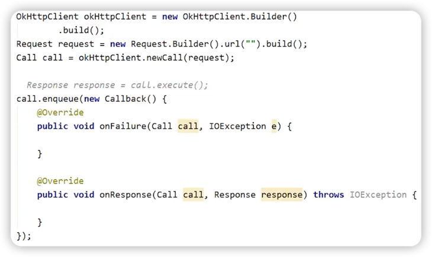
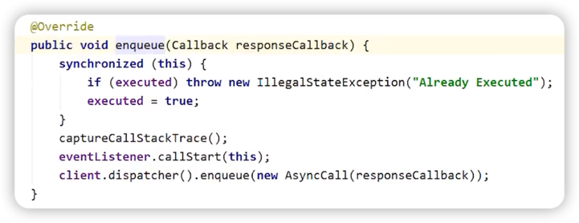
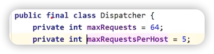
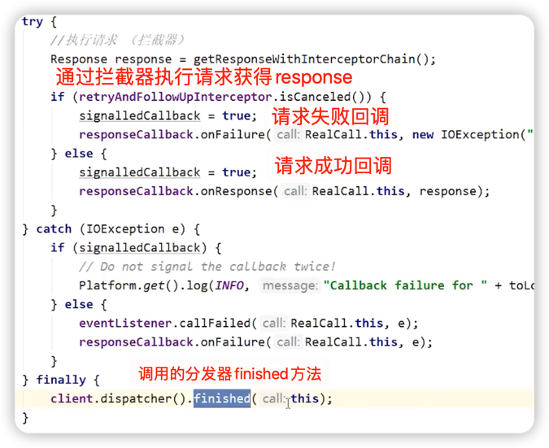
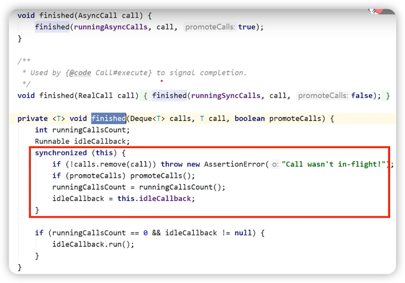
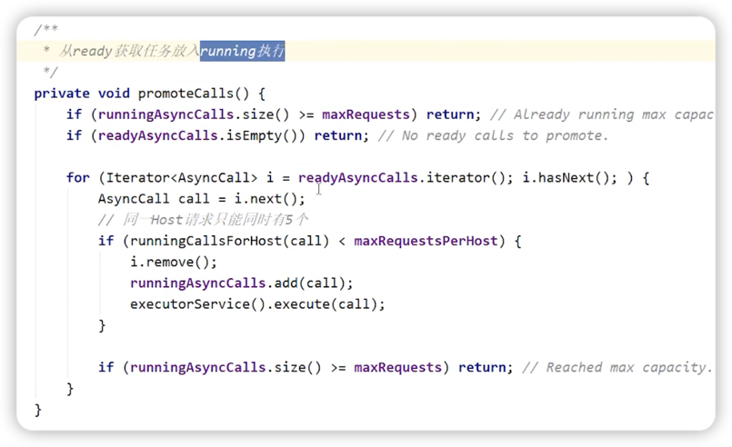
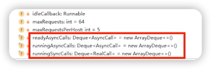

# OKHTTP分发器原理

必背关键词
1. RealCall
2. Dispatcher
3. AsyncCall
4. runningAsyncCalls
5. readyAsyncCalls

### 分发器异步请求流程总结
1. **OkHttpClient**调用**newCall**后会生成一个**RealCall**。
2. 通过**RealCall**来执行**enqueue**方法发起异步请求，内部会调用**Dispatcher**的**enqueue**，传入一个**AysncCall**对象。
3. **Dispatcher**会根据正在执行的请求数和正在执行的同域名请求数来决定将**AysncCall**放入**runningAysncCalls**还是**ReadyAsyncCalls**。
4. 如果放入**runningAsyncCalls**，则会由线程池来调度执行。
5. 如果放入**readyAysncCalls**，则会在请求完成后由**Dispatcher**再次尝试放入**runningAsyncCalls**中。
   

***

## newCall方法创建RealCall
RealCall实现了Call接口，创建过程如下所示：

***

## enqueue异步请求源码解析
> ### **RealCall.enqueue()**
> 
> ### 代码分析
> 1. 在同步代码块中判断请求是否已被执行，是则抛出异常，防止重复请求。
> 2. eventListener执行监听，例如监听请求开始，DNS解析开始，DNS解析结束，连接开始等等。
> 3. **核心代码。调用分发器的enqueue方法，传入了AsyncCall(封装了请求信息)。**

> ### **Dispatcher.enqueue**
>
>
> 
> ### 代码分析
> ***
> ① 判断正在执行的异步请求个数不大于64  
> 
> 
> ***
> ② 限制同一个域名的请求数不大于5  
> 
> 
> ***
> ③ 如果条件成立，则将AsyncCall放入runningAysncCalls，让线程池去执行。 
> 
> >🤔 线程池的execute做了什么？
> 
> 
> 
> >🤔 finished方法做了什么
> 
> 
> 
> 在promoteCalls中将ready任务放入running中执行
> 
> 
> 
> ***
> ④ 如果条件不成立，则放入runningSyncCalls。
> 
> **每完成一次请求，分发器会尝试将ready中的任务放入到running中去执行**。
> 
> > #### Dispatcher中的三个数组双端队列：  
> >  
> **runningAysncCalls**：正在执行的异步任务队列。  
> **readAysncCalls**：准备执行的异步任务队列。  
> **runningSyncCalls**：正在执行的同步任务队列。
> 
> 
> 

***

