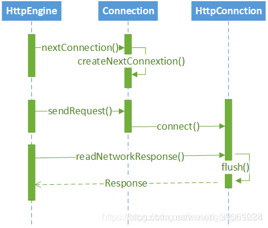

> HttpEngine 在发起请求之前，会先调用 ____ 来获取一个Connection对象，
> 如果可以从 ____ 中获取一个Connection对象，就不会新建，
> 如果无法获取，就会调用 ____ 来新建一个Connection对象，
> 这就是 Okhttp 多路复用的核心，不像之前的网络框架，无论有没有，都会新建Connection对象。
> 

查看答案

<pre>
nextConnection() ConnectionPool createNextConnection()
</pre>

