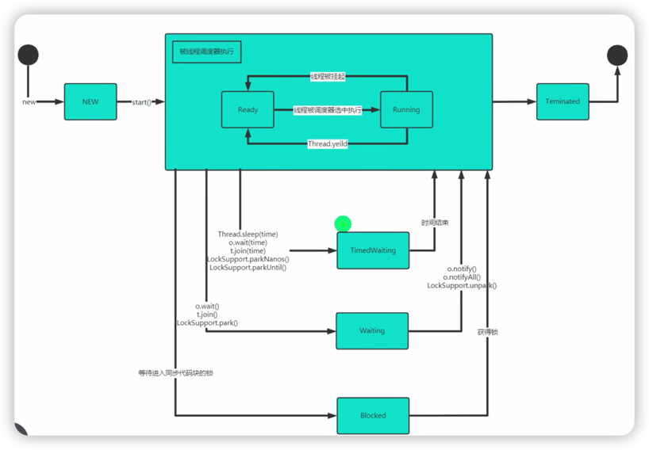

# 线程的状态和生命周期

## 线程状态与生命周期图


## 基础状态

新建New → 可运行Runnable（就绪或运行中） → 终止Terminated

``` java
Runnable runnable = new Runnable(){
    @Overrider
    public void run(){
        // ...
        // ③：当run方法执行完成后，线程进入Terminated（终止）状态
    }
}

// ①：当新建一个线程后，线程处于New（新建）状态
Thread t = new Thread(runnable);

// ②：调用start方法后，线程处于Runnable（可运行）状态
//
// Runnable可以细分为两个状态（处于哪个状态由CPU决定）
// 1. Ready（就绪）：等待被CPU线程调度器调度。
// 2. Running（运行中）：正在被CPU调度器执行。
t.start();
```

## 休眠状态
1. Blocked阻塞：等待进入synchronized方法(代码块)
2. Waiting等待：Object.wait()，Thread.join()
3. TimedWaiting超时等待：Thread.sleep()，Thread.join()

> 🤔：Waiting和TimedWaiting的区别？
> > 退出状态的条件不同：  
> Waiting：Object.notify()，Object.notifyAll()。  
> TimedWaiting：时间结束。
