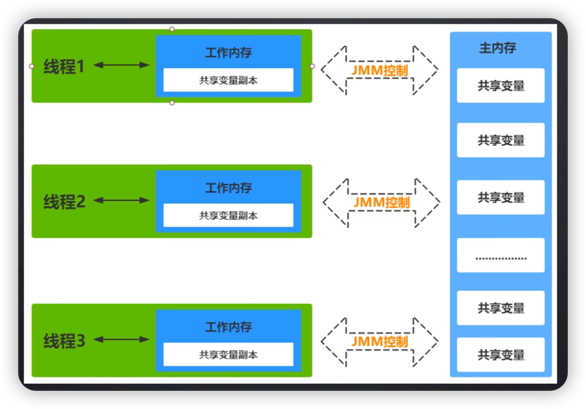

# Java内存模型

1. 线程不会直接操作主内存中的共享变量，而是将共享变量拷贝到线程的工作内存中。
2. 修改了变量副本后，再将修改结果刷回主内存。

> #### 加深理解
> 1. 把主内存看做是代码远程仓库，把共享变量看做是代码文件。
> 2. 把线程当做是开发者，把工作内存看做是本地仓库。
> 
> 各个线程（开发者）可以直接访问远程分支的代码，但是不能直接修改，必须先把远程仓库clone到本地，在本地完成修改后，再push回远程仓库。

## volatile保证可见性原理

当线程对共享变量的副本进行修改后，同步回主内存的时间是不确定的，最晚是线程结束前。
> 开发者A对本地代码修改后，push回远程的时间是不确定的，但最晚是在项目提测前。

1. volatile修饰的变量一旦被修改，会立即刷回主内存将。
   > 将本地修改push到远程仓库。
2. 其它线程会监听到变化(总线嗅探机制)，然后失效掉当前线程变量副本，重新从主内存读取。
   > 其它开发者会放弃自己的修改(revert操作)，然后更新代码(pull操作)。