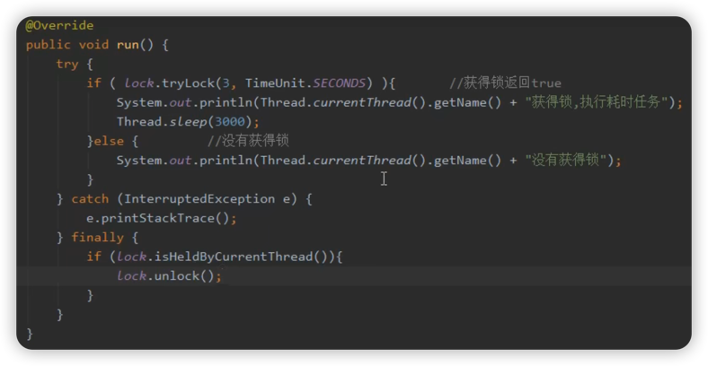
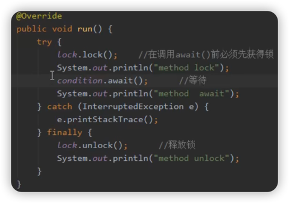
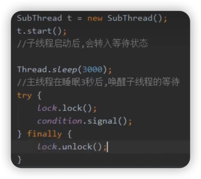

# ReentrantLock使用介绍

1. lock和unlock方法
2. lockInterruptibly方法
3. tryLock方法
4. newCondition方法

## lock和unlock方法
1. void lock()：获取锁，如果锁被占有，则等待。
   > 应在try代码块中执行。
2. void unlock()：释放锁。
   > 应该在finally代码块中执行。

[查看代码](code/Lock.java)

## lockInterruptibly方法

能够中断等待获取锁的线程，需搭配Thread.interrupt()使用。

> #### 小剧场
> 1. 线程A：调用lock.lockInterruptibly()获取锁
> 2. 线程A：获取到了锁，并执行死循环。
> 3. 线程B：调用lock.lockInterruptibly()获取锁
> 4. 线程B：等待中...
> 5. 线程B：等的不耐烦了😡！调用interrupt方法，抛出异常，结束执行。

## tryLock方法

#### tryLock(long time, TimeUnit unit)

尝试获取锁，传入超时时间，成功返回true，失败返回false，不阻塞。

### tryLock()

尝试获取锁，如果锁没有被其它线程持有，则获取(返回true)，否则放弃(返回false)。

> #### 小剧场
>
> #### tryLock(time, unit)：
> 张三打算去追小红，1个月内能追到就订婚，否则放弃。
>
> #### tryLock()
> 李四也打算去追小红，若小红没被张三追到，则继续追求，否则立马放弃。

## newCondition方法

1. 返回一个Condition对象。
2. 作用等同于 wait/notify 机制。
3. Condition可以选择要唤醒的线程。
4. Condition.await()：让当前线程等待。
5. Condition.signal()：唤醒一个等待的线程。
6. 调用await/signal，无需搭配synchronized，但需要当前线程持有Lock锁。

