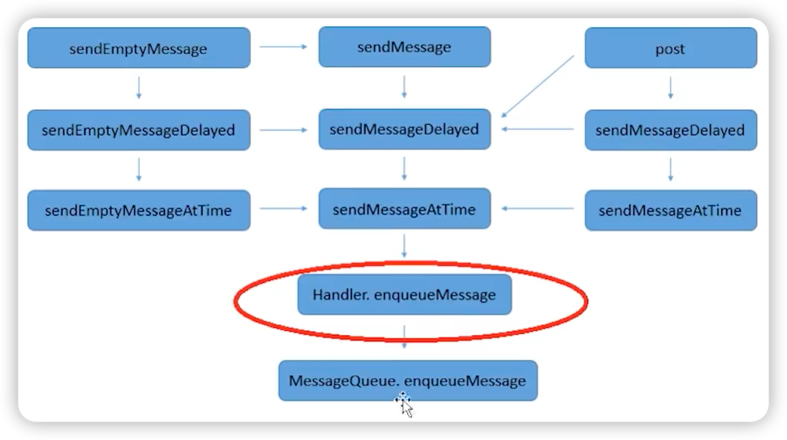

# sendMessage消息入队

## 概览



Handler.java
> sendMessage → sendMessageDelayed 
→ sendMessageAtTime
→ enqueueMessage

MessageQueue.java
> enqueueMessage

***
## 源码
### Handler.java

``` java
public final boolean sendMessage(@NonNull Message msg) {
    return sendMessageDelayed(msg, 0);
}
```

``` java
public final boolean sendMessageDelayed(@NonNull Message msg, long delayMillis) {
    if (delayMillis < 0) {
        delayMillis = 0;
    }
    return sendMessageAtTime(msg, SystemClock.uptimeMillis() + delayMillis);
}
```

``` java
public boolean sendMessageAtTime(@NonNull Message msg, long uptimeMillis) {
    MessageQueue queue = mQueue;
    if (queue == null) {
        return false;
    }
    return enqueueMessage(queue, msg, uptimeMillis);
}
```

``` java
private boolean enqueueMessage(@NonNull MessageQueue queue, @NonNull Message msg,
        long uptimeMillis) {
    msg.target = this;
    msg.workSourceUid = ThreadLocalWorkSource.getUid();

    if (mAsynchronous) {
        msg.setAsynchronous(true);
    }
    return queue.enqueueMessage(msg, uptimeMillis);
}
```

### Message.java
``` java
public final class Message implements Parcelable {

    // Message是单链表结构
    // 管理Message的MessageQueue也是链表
    Message next;
    
    // 目标Handler，取出消息时会用到
    Handler target;
    
    // ...
    
}
```

### MessageQueue.java

``` java
boolean enqueueMessage(Message msg, long when) {

    synchronized (this) {
        if (mQuitting) {
            msg.recycle();
            return false;
        }

        msg.markInUse();
        msg.when = when;
        Message p = mMessages;
        boolean needWake;
        if (p == null || when == 0 || when < p.when) {
            msg.next = p;
            mMessages = msg;
            needWake = mBlocked;
        } else {
            needWake = mBlocked && p.target == null && msg.isAsynchronous();
            Message prev;
            for (;;) {
                prev = p;
                p = p.next;
                if (p == null || when < p.when) {
                    break;
                }
                if (needWake && p.isAsynchronous()) {
                    needWake = false;
                }
            }
            msg.next = p; // invariant: p == prev.next
            prev.next = msg;
        }

        // We can assume mPtr != 0 because mQuitting is false.
        if (needWake) {
            nativeWake(mPtr);
        }
    }
    return true;
}
```