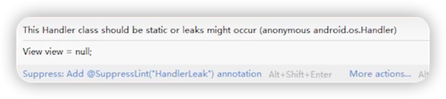
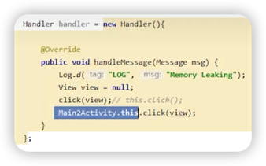
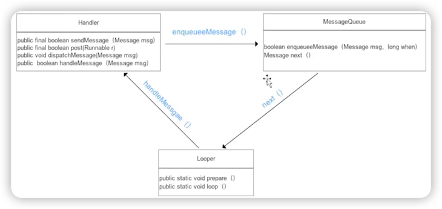

# Handler机制中内存泄漏的原因

## 表面原因

当以非静态内部类的形式使用Handler时，AS会给出内存泄漏提示：




非静态内部类（匿名内部类）会持有外部类的应用，容易导致内存泄漏：


> click(view) 相当于 Main2Activity.this.click(view)


***

## 深层原因

引用持有链：MessageQueue -> Message -> Handler -> Activity（占用大量内存）



当Handler将Message发送给MessageQueue后，MessageQueue就持有了Message。

``` java
private boolean enqueueMessage(@NonNull MessageQueue queue, @NonNull Message msg,
        long uptimeMillis) {
    // Message持有了Handler的引用
    // 而Handler又持有着外部Activity的引用
    msg.target = this;
    
    return queue.enqueueMessage(msg, uptimeMillis);
}
```

***

## 处理方案

1. 在onDestroy中清空handler中所有的Message。
2. 将Handler声明为静态内部类，用软引用或弱引用持有Activity。