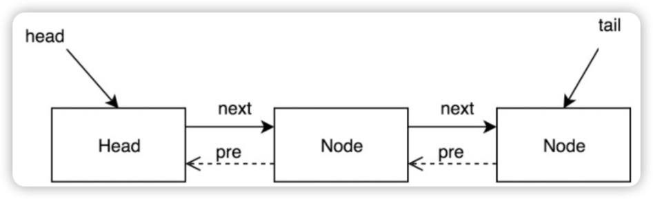

# ReentrantLock原理

ReentrantLock主要利用CAS+AQS队列来实现。它支持公平锁和非公平锁。

``` java
private Lock lock = new ReentrantLock();

public void test(){
    lock.lock();
    try{
        doSomeThing();
    } catch (Exception e){
        // ...
    } finally {
        // 保证lock一定被释放
        lock.unlock();
    }
}
```

***

## CAS简介

### 全称
Compare And Swap（比较并变换）。

### 3个操作数
1. 内存值V
2. 预期值A
3. 要修改的新值B

``` java
// 伪代码演示
// 💡该操作是一个原子操作，被广泛的应用在Java的底层实现中

// 当且仅当预期值A和内存值V相同时
if(A == V){
    // 将内存值V修改为B，否则什么都不做
    V == B;
}
```

### 底层实现
由sun.misc.Unsafe类通过JNI调用CPU底层指令实现。

***

## AQS简介

### 全称
Abstract Queued Synchronizer（抽象排队同步器）

### 定义
1. 一个用于构建锁和同步容器的框架。
2. 解决了在实现同步容器时设计的大量细节问题。
3. 基于AQS构建的concurrent包下的类：
    1. ReentrantLock
    2. Semaphore（信号）
    3. CountDownLatch
    4. ReentrantReadWriteLock
    5. FutureTask
    6. ...
   
### 原理



> AQS使用一个FIFO的队列表示排队等待锁的线程，
> 
> 队列头节点称作“哨兵 节点”或者“哑节点”，它不与任何线程关联。
> 
> 其他的节点与等待线程关联， 每个节点维护一个等待状态waitStatus

***

## 原理


