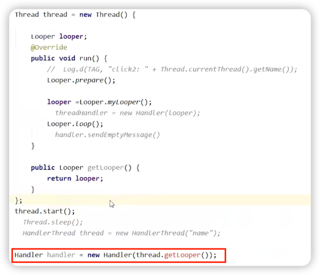

# 子线程中如何创建Handler

1. main()中已经为主线程创建了Looper，因此主线程中可以直接new Handler()。
3. 子线程不能直接new Handler()，必须传入子线程的Looper对象。

## 在子线程使用Handler错误演示

下面这种写法存在线程安全问题，因为thread.getLooper()有可能返回null。



## 使用HandlerThread

通过wait/notify机制，保证getLooper()一定在在Looper创建之后执行。

``` java
@Override
public void run() {
    mTid = Process.myTid();
    Looper.prepare();
    synchronized (this) {
        mLooper = Looper.myLooper();
        notifyAll();
    }
    Process.setThreadPriority(mPriority);
    onLooperPrepared();
    Looper.loop();
    mTid = -1;
}
```

``` java
public Looper getLooper() {
    
    boolean wasInterrupted = false;
    
    // If the thread has been started, wait until the looper has been created.
    synchronized (this) {
        while (isAlive() && mLooper == null) {
            try {
                wait();
            } catch (InterruptedException e) {
                wasInterrupted = true;
            }
        }
    }

    /*
     * We may need to restore the thread's interrupted flag, because it may
     * have been cleared above since we eat InterruptedExceptions
     */
    if (wasInterrupted) {
        Thread.currentThread().interrupt();
    }

    return mLooper;
}
```