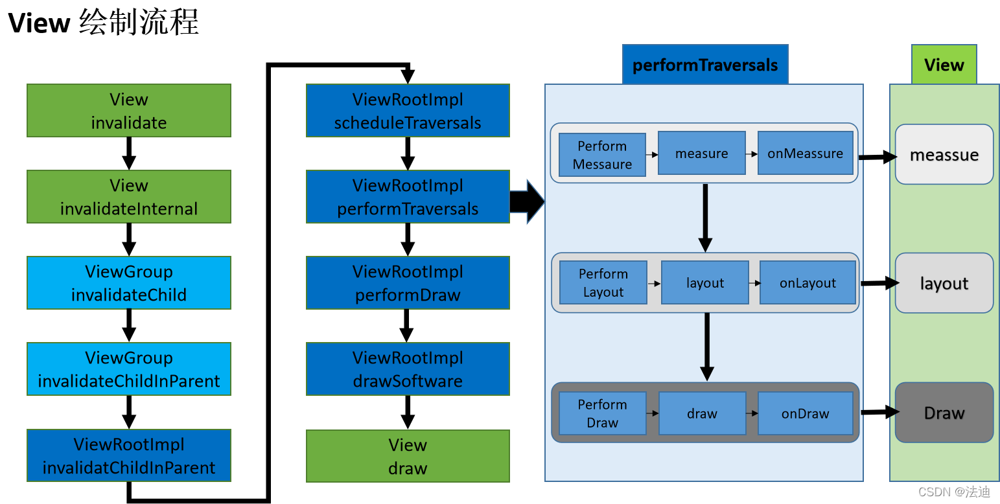
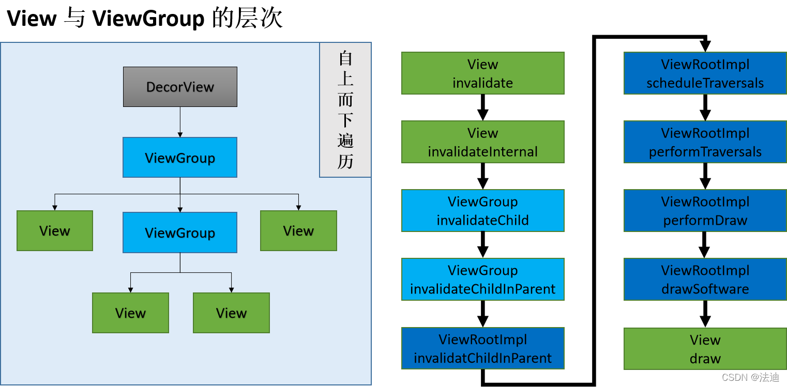
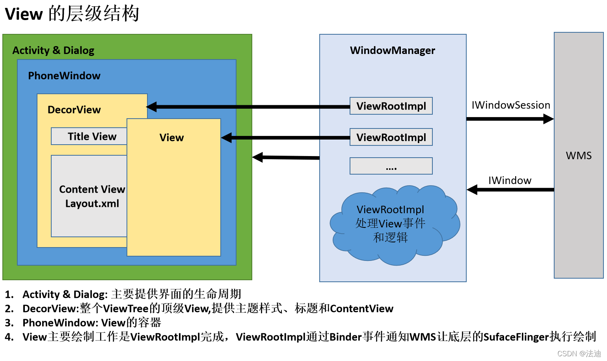

# 概述

## View的绘制流程

## View与ViewGroup的层次

## View的层次结构

1. Activity & Dialog: 主要提供界面的生命周期。
2. PhoneWindow: View的容器。
3. DecorView:整个ViewTree的顶级View,提供主题样式、标题和ContentView。
4. View主要绘制工作是ViewRootImpl完成，ViewRootImpl通过Binder事件通知WMS让底层的SurfaceFlinger执行绘制。

