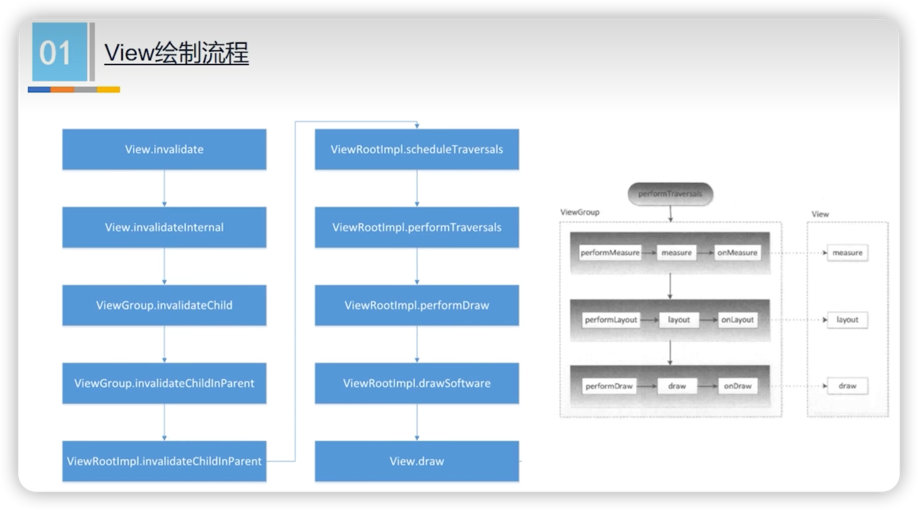
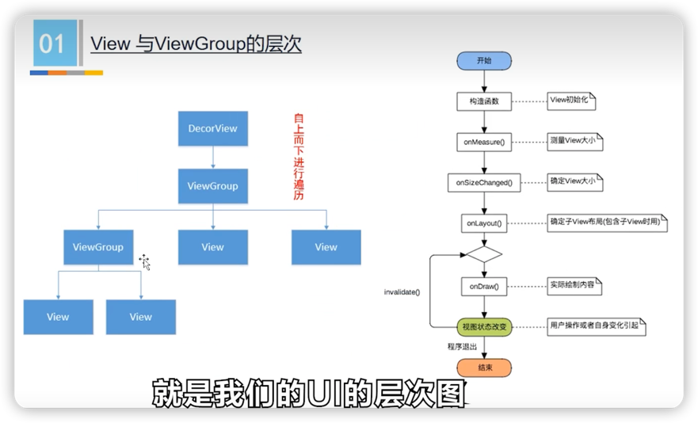

# View的绘制流程

## 1. 关于onMeasure()，onLayout()，onDraw()

1. 只是自定义View时需要实现的核心函数。
2. 它们不能代表UI的绘制流程！

## 2. 绘制流程

协助记忆：5个invalidate(内、子、父子x2) + performTraversals(前schedule后3个perform) + draw

[查看代码流程](doc/View的绘制流程.md)

记住上述流程的关键，首先在于理解V**iew、ViewGroup、ViewRootImpl**的关系。

