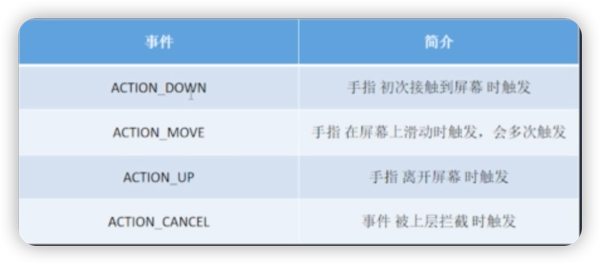
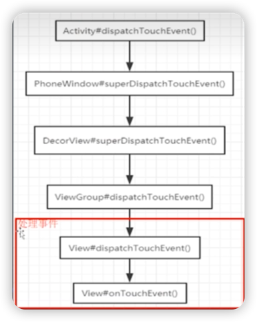

# 事件是如何处理的

## 1. 主要触摸事件

***

## 2. 事件的分发和处理

### 1. 分发者和处理者
1. View：只能处理事件。
2. ViewGroup：先走分发事件流程，再走处理事件流程。

### 2. 分发处理流程

1. 流：**Activity→PhoneWindow→DecorView→ViewGroup→View**。
2. 方法：**dispatchTouchEvent()**

### 3. [分发源码](doc/activity.md)

### 4. Action.Down

***

#### 案例
[点击按钮(设置了点击监听和触摸监听)](doc/case1.md)