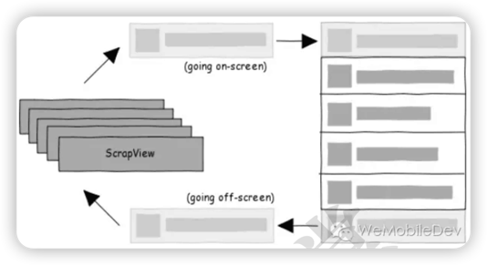
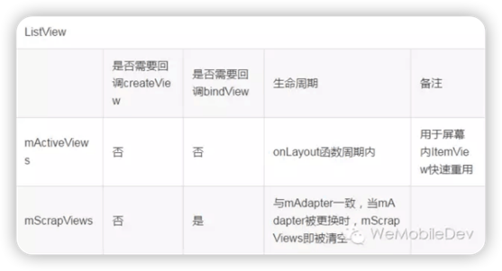
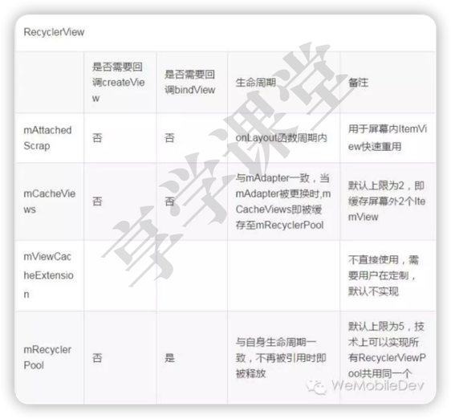

# RecyclerView与ListView对比
1. 缓存机制对比
2. RecyclerView局部刷新
3. 何时用ListView？何时用RecyclerView？
## 缓存机制对比

### 背景
ListView与RecyclerView缓存机制原理大致相似，如下图所示：

>在滑动过程中：
>1. 离屏的Item，被回收至缓存。
>2. 入屏的Item，优先从缓存中获取。

两者只是实现细节上有差异。

1. 层级不同
2. 缓存不同

### 层级不同
ListView：两级缓存。(Scrap是废弃的意思)

RecyclerView：四级缓存。

### 缓存不同
1. RecyclerView缓存的是RecyclerView.ViewHolder，详见[RecyclerView获取缓存的流程](doc/RecyclerView获取缓存的流程.md)。
2. ListView缓存的是View，详见[ListView获取缓存的流程](doc/ListView获取缓存的流程.md)。

***
## RecyclerView局部刷新
相较于缓存机制，RecyclerView更大的亮点在于提供了局部刷新的接口。

通过局部刷新，就能避免调用许多无用的bindView。

[图片]()

结合RecyclerView的缓存机制，看看[局部刷新](doc/RecyclerView局部刷新实现原理.md)是如何实现的。

***
## 何时用ListView？何时用RecyclerView？
在很多场景中，ListView和RecyclerView都能很好地工作，两者并没有很大的差异。

1. 不需频繁更新的场景，使用ListView即可，见[微信Android客户端卡券模块](doc/微信Android客户端卡券模块.md)。

2. 数据源频繁更新或需要用到动画的场景，RecyclerView的优势会非常明显，如[弹幕](http://www.jianshu.com/p/2232a63442d6)。
