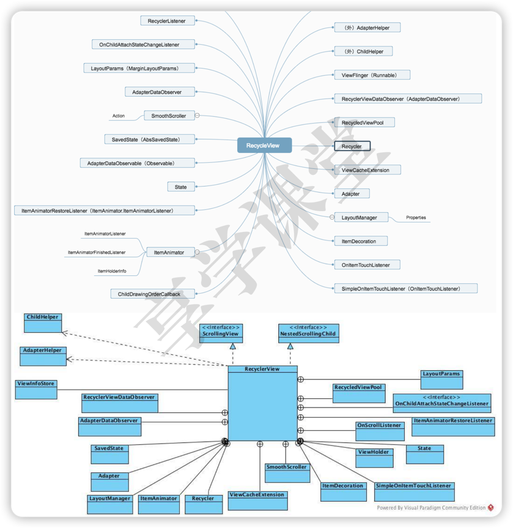

# RecyclerView源码分析

## RecyclerView的代码设计结构



1. RecyclerViewDataObserver：数据观察器
2. Recycler：View循环复用系统，核心部件
3. SavedState：RecyclerView状态
4. AdapterHelper：适配器更新
5. ChildHelper：管理子View
6. ViewInfoStore：存储子VIEW的动画信息
7. Adapter：数据适配器
8. LayoutManager：负责子VIEW的布局，核心部件
9. ItemAnimator：Item动画
10. ViewFlinger：快速滑动管理
11. NestedScrollingChildHelper：管理子VIEW嵌套滑动
***
## 绘制详情
以下代码展示了RecyclerView的基础用法。
``` java
recyclerView = (RecyclerView)findViewById(R.id.recyclerView);
findViewById(R.id.recyclerView);
LinearLayoutManager layoutManager = new
LinearLayoutManager(this);
// 设置布局管理器
recyclerView.setLayoutManager(layoutManager);
// 设置为垂直布局，这也是默认的
layoutManager.setOrientation(OrientationHelper.VERTICAL);
// 设置Adapter
recyclerView.setAdapter( recycleAdapter);
// 设置分隔线
recyclerView.addItemDecoration(new DividerGridItemDecoration(this ));
// 设置增加或删除条目的动画
recyclerView.setItemAnimator(new DefaultItemAnimator());
```

### 第一步
了解[RecyclerView的构造方法](doc/RecyclerView的构造方法.md)。
``` java
recyclerView = (RecyclerView) findViewById(R.id.recyclerView);
```
