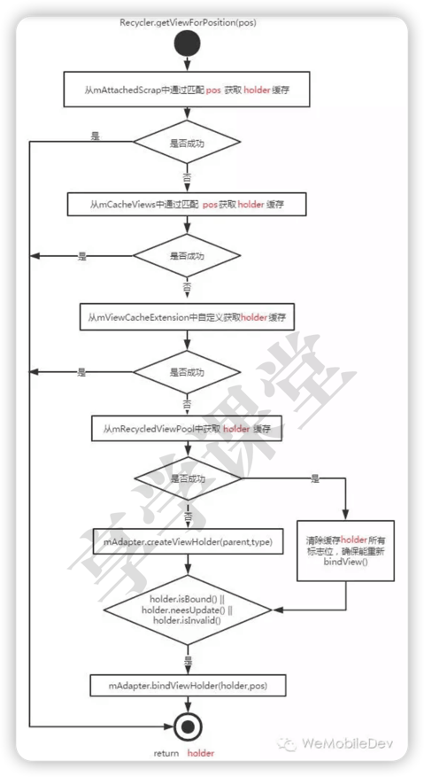
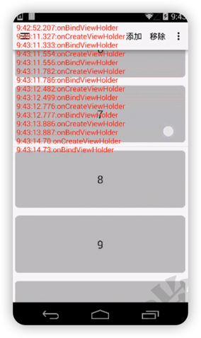

# RecyclerView获取缓存的流程



RecyclerView中mCacheViews(屏幕外)获取缓存时，是通过匹配pos获取目标位置的缓存，这样做的好处是，当数据源数据不变的情况下，无须重新bindView。



而同样是离屏缓存，ListView从mScrapViews根据pos获取相应的缓存，但是并没有直接使用，而是重新getView（即必定会重新bindView）

#### AbsListView.java(line2345)
``` java
//通过匹配pos从mScrapView中获取缓存
final View scrapView = mRecycler.getScrapView(position);

//无论是否成功都直接调用getView,导致必定会调用createView
final View child = mAdapter.getView(position, scrapView, this);
if (scrapView != null) {
    if (child != scrapView) {
        mRecycler.addScrapView(scrapView, position);
    } else {
        // ...
    }
}
```

ListView中通过pos获取的是view，即pos-->view；

RecyclerView中通过pos获取的是viewholder，即pos --> (view，viewHolder，flag)；

从流程图中可以看出，标志flag的作用是判断view是否需要重新bindView，这也是RecyclerView实现局部刷新的一个核心。