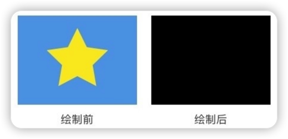
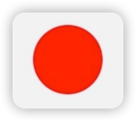
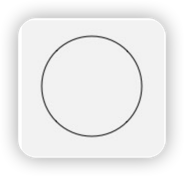

# Canvas和Paint
***
### Canvas.<font color=#33a3dc>**drawColor**</font>(@ColorInt int color) 
#### <font color=#dea32c>**颜色填充**</font>

在整个绘制区域统一涂上指定的颜色。

``` java
drawColor(Color.BLACK); // 纯黑 
// 类似方法
canvas.drawRGB(100, 200, 100);
canvas.drawARGB(100, 100, 200, 100); 
```



***

### <font color=#33a3dc>**drawCircle**</font>(float centerX, float centerY, float radius, Paint paint) 
#### <font color=#dea32c>**画圆**</font>
centerX centerY 是圆心的坐标，radius 是圆的半径，单位都是像素

``` java
paint.setColor(Color.RED); // 设置为红色
canvas.drawCircle(300, 300, 200, paint); 
```



> 了解<font color=#dea32c>**Paint.setStyle(Paint.Style style)**</font>
> 
> paint.setStyle(Paint.Style.STROKE); // Style 修改为画线模式
> 
> 

> 了解<font color=#dea32c>**Paint.setStrokeWidth(float width)**</font>
> 
> paint.setStyle(Paint.Style.STROKE);
> 
> paint.setStrokeWidth(20); // 线条宽度为 20 像素
> 
> canvas.drawCircle(300, 300, 200, paint); 
> 
> 
